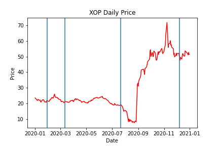

# **XLE index analysis**

Given that XLE was the index that had a greater loss over the time period analyzed, we will look deeper into it and try to breakdown how particular industries inside this economic sector behaved

# *XLE index breakdown*

The XLE index contains industries from the Energy economic sector, which, in turn, contains the following industries:
- Energy Equipment & Services Industry
- Oil, Gas & Consumable Fuels Industry

### The XLE index portfolio is built as follows:
|Companies|Weight in index|
|---|---|
|Oil & Gas Refining and Marketing|56.71%
|Oil & Gas Exploration and Production|23.51%
|Oil & Gas Transportation Services|9.74%
|Oil Related Services and Equipment|8.59%

### From the S&P Industry Modified Weighted Index

- This index breaks down into more specific industries, in our case we chose the following two indexes:

|Industry (Modified Weighted Index)|Ticker|
|---|---|
|SPDR S&P Oil & Gas Exploration & Production|XOP|
|SPDR S&P Oil & Gas Equipment & Services|XES|

- The preliminary analysis shows that even though the energy economic sector suffered a great loss during the COVID-19 pandemic, the Oil&Gas industry has managed to increase its stock price substantially

- However, if we look at the standard deviation for each stock, we can determine that both stocks are very volatile, assuming that this particular industry is very sensitive to worldwide phenomenoms and for our particular study COVID-19 should have impacted very negatively this particular industry

- Plotting the daily price line graph for both our indexes we can see that even though the pandemic had a great impact on the Oil&Gas industry, it's recovery has been equally impressive, to the point that stock price by the end of our study was well above pre-pandemic times
- We can also conclude that this behaviour is industry wide, since both indexes available, show very similar stock behaviour

# *References*

XLE (2021,05,05). In ETF. https://www.etf.com/XLE#overview  
What Are the Sectors and Industries of the S&P 500? (2021,05,05). In the balance. https://www.thebalance.com/what-are-the-sectors-and-industries-of-the-sandp-500-3957507  
spdr-etf-listing.pdf (2021-05-05). In State Street Global Advisors SPDR. https://www.ssga.com/library-content/products/fund-docs/etfs/us/information-schedules/spdr-etf-listing.pdf

