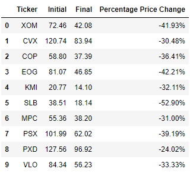
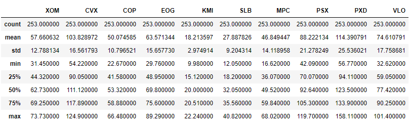
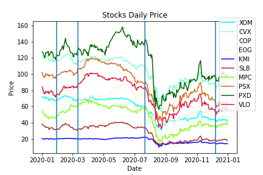

# **XLE index analysis**

Given that XLE was the index that had a greater loss over the time period analyzed, we will look deeper into it and try to breakdown how particular industries inside this economic sector behaved

# *XLE index breakdown*

The XLE index contains industries from the Energy economic sector, which, in turn, contains the following industries:
- Energy Equipment & Services Industry
- Oil, Gas & Consumable Fuels Industry

### The XLE index portfolio is built as follows:
|Companies|Weight in index|
|---|---|
|Oil & Gas Refining and Marketing|56.71%
|Oil & Gas Exploration and Production|23.51%
|Oil & Gas Transportation Services|9.74%
|Oil Related Services and Equipment|8.59%

- The top 10 stocks that constitute 77.79% of the index are:

|Ticker|Company|Percentage|
|---|---|---|
|XOM|Exxon Mobil Corp|22.36%|
|CVX|Chevron Corp|22.13%|
|COP|ConocoPhillips|4.34%|
|EOG|EOG Resources Inc|5%|
|KMI|Kinder Morgan Inc|3.83%|
|SLB|Schlumberger Nv|4.49%|
|MPC|Marathon Petroleum Corp|4.11%|
|PSX|Phillips 66|4.21%|
|PXD|Pioneer Natural Resource|3.86%|
|VLO|Valero Energy Corp|3.46%|

- From our previous analysis we concluded that the energy economic sector suffered a loss of %41.00 during the time period, by analyzing the companies that constitute the index we can clearly see that the tendency continues, but it is interesting to notice that some companies like Pioneer Natural Resource (PXD) was able to soften the blow, a company that is heavily related to low-carbon energy investigation

- However, if we look at the standard deviation for each stock, we can determine that most of the stocks are very volatile, assuming that this particular industry is very sensitive to worldwide phenomenoms and for our particular study COVID-19 should have impacted very negatively this particular industry

## Bar chart analysis
By looking at the graph we can see that there is no significant difference in the price of a stock and its performance, the relative price different stays relatively the same within the industry

## Line graph analysis

Plotting every stock together do provide very valuable insights, as we can see the stocks had a similar behaviour pre-pandemic, as the WHO announces the pandemic the stocks present a small peak, but as quarantines start around the globe, the behaviour of the stocks are somehow erratic with a notable exception of Pioneer Natural Resources (PXD) a company that starts to separate itself from the rest of the stocks. Now, what we believe is one of the most notable phenomena is how all the stocks converge to a couple of weeks after the announcement of Phase 1 vaccines testing. Every stock apparently plummets and tries to converge to a minimum value, and after that, the stock begins to stabilize and recover

# *References*

XLE (2021,05,05). In ETF. https://www.etf.com/XLE#overview  
What Are the Sectors and Industries of the S&P 500? (2021,05,05). In the balance. https://www.thebalance.com/what-are-the-sectors-and-industries-of-the-sandp-500-3957507  
spdr-etf-listing.pdf (2021-05-05). In State Street Global Advisors SPDR. https://www.ssga.com/library-content/products/fund-docs/etfs/us/information-schedules/spdr-etf-listing.pdf

